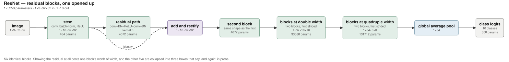

# draughtsman

**Readable architecture diagrams for PyTorch models.** The tracer supplies the
facts, an agent supplies the abstraction, and a coverage check proves nothing was
silently dropped.

> **Status: the three stages work end to end on the model that prompted them.**
> [`SPEC.md`](SPEC.md) carries the design, the measurements behind it, and the
> failure it exists to prevent. [`DECISIONS.md`](DECISIONS.md) answers what the
> spec left open and records three places building found it mistaken — read that
> second, and before changing the trace layer.

```
draughtsman trace    bugarach.learn.nets.tube:build_tube --input-shape 1,30,600 -o graph.json
draughtsman abstract graph.json -o spec.json     # prints the prompt; an agent answers it
draughtsman check    spec.json graph.json        # every traced node in exactly one stage
draughtsman render   spec.json -o figure.svg
draughtsman ui       spec.json                    # review and fix it in a browser
```

`trace` needs torch. `check` and `render` need nothing at all — no torch, no
graphviz, no system binary — because the layout is ours. See
[`examples/tube/`](examples/tube/) for the result on the model below, and for
where every number in it comes from.

## What it produces



Nine stages over 52 traced operations. Every quantity — `464 params`, `kernel 3`,
`1×16×32×32`, `10 classes` — is looked up from `graph.json` by node id at render
time; none of it is typed into the spec. The residual identity is a dashed arc
because it is a real fork in the traced graph. The other five blocks are
collapsed into two boxes, and the caption says so rather than letting the figure
imply the model is nine layers deep.

That figure and nine others are in [`examples/`](examples/), each with the
`graph.json` it was measured from and the `spec.json` that arranged it.

## Why this exists

A 1,149-parameter model was drawn by five existing tools. Every one of them
failed, and they failed in two families:

| tool | what it did |
|---|---|
| **torchview** | Traced the true op graph. **Correct** — and forty nodes of `exp`/`clamp`/`div` in a strip one pixel tall at page width. |
| **pytorch-graph** (`research_paper` style) | Clean, styled, **and wrong** — see below. |
| **visualtorch** | 993 × **13 pixels**. Its renderers scale block height by channel count; this model has ≤ 8. |
| **nn-SVG** | Browser-only, no API. FCNN / LeNet / AlexNet styles, all linear stacks, aimed at 2D image CNNs. No branching. |
| **Model Explorer** (Google AI Edge) | Ingests PyTorch *ExportedProgram*. `torch.export` **cannot export this model** — data-dependent control flow. Doubly unavailable, and it is an interactive debugging viewer rather than a figure generator. |

**The pytorch-graph result is the one that matters.** It produced a clean
publication-styled figure of `head.0` … `head.12` and silently omitted the
max-pool, the mean over cells, the four difference-of-Gaussian kernels, the
bypass and the concat — which is to say, the architecture. Every shape field read
`Input: ()`. The summary box asserted *"Output Classes: Variable · End-to-end
trainable · GPU compatible."*

It enumerates registered `nn.Module` children. That model's architecture lives in
`forward()`. So the tool drew a plain thirteen-layer conv stack and called it the
model, and a reader would come away confident and wrong.

## The gap, stated once

Tools either **trace the computation graph** — complete, unreadable — or
**enumerate registered modules** — readable, and blind to everything a `forward()`
does. Neither can decide *which operations matter*, because that is a judgement
about what a reader needs, not a fact about the graph.

That judgement is the only missing piece, and it is now cheap. Tony, 2026-09-01:

> *"except now we have very powerful coding agents. i'm fine with putting an agent
> in there for internal use."*

So: trace for the facts, agent for the abstraction, and a mechanical check that
the abstraction did not lose anything — because losing the architecture quietly is
exactly what the existing tools do.

## The three stages, and why the split is the design

```
  model ──▶ [1 TRACE] ──▶ graph.json ──▶ [2 ABSTRACT] ──▶ spec.json ──▶ [3 RENDER] ──▶ figure.svg
             facts          facts          judgement        judgement      deterministic
             (torch)                       (agent)          (committed)
```

**The agent never supplies a fact.** Not a parameter count, not a shape, not a
kernel width. It supplies groupings, human names and topology. Where the figure
wants a number, `spec.json` carries a reference — `{stage.params}`,
`{node:n0149.constants.dilation}` — and the renderer looks it up in `graph.json`
by node id. An agent that hallucinates a parameter count produces exactly the
confident-and-wrong figure pytorch-graph produced, and coverage would not catch it
because every node would still be covered.

**Every traced node must be accounted for in exactly one stage.** Not zero, not
two. A node may be marked `elided` explicitly, with a reason — a decision in a
diff, not a silent loss. It is precisely what pytorch-graph lacked — and it is the
FIRST of the assertions that make an agent safe here, not the only one. Four more
things have since been caught being confidently wrong while coverage was green:
see [`DECISIONS.md`](DECISIONS.md) correction 5.

Coverage passing says nothing about whether the figure is any good. `check` says
so in its own output, so a green check is never read as a good figure.

## `draughtsman ui` — the part coverage cannot do

The check ends by naming what it does not verify: whether the names are good, the
grouping is natural, the figure legible. That is a person's job, and `ui` is where
they do it — the figure, the coverage panel, and every traced node in one place,
with the grouping editable and the picture redrawing as you change it.

```
draughtsman ui examples/tube/spec.json     # one model
draughtsman ui examples/                   # every model under it
```

Point it at a directory and it finds one model per folder — a `graph.json` with
its `spec.json` beside it, which is the convention `examples/tube/` already
follows. **`All models` renders every figure onto one sheet**, each with its
coverage state and aspect ratio, and clicking one opens it for editing. Unsaved
edits survive switching, and a model carrying them is marked in both the picker
and the sheet.

That sheet is a visual regression test. A layout defect in one model of ten does
not announce itself in a passing check — coverage is about what was *dropped*, not
about what the picture looks like — and opening ten tabs to find it is how it stays
unfound. The half a machine can check is parametrised in `tests/test_render.py`,
so every committed model has its coverage and its figure's freshness asserted;
adding a folder adds a test.

Standard library only; it binds to localhost and writes the two paths you named.

**Every picture it shows comes from the same `render()` the CLI calls.** A
browser-side re-implementation would have been quicker and would have meant the
figure you judged was never the figure that shipped — so `Save` writes `spec.json`
and `figure.svg` together, byte-identical to the CLI's, and a test asserts it.

**Save writes into the repo; Export takes a copy out.** `Export ▾` (⌘E) gives you
Copy SVG, Download SVG, and PNG at 1×, 2× or 4×. The SVG it hands over is the
exact string `render()` produced — the same bytes `Save` writes — rather than a
re-serialisation of what the browser is displaying. The PNG is rasterised from
that, on a white ground, because the figure ships no background of its own and a
PNG has no page to inherit one from. For print or LaTeX, prefer the SVG.

If coverage is failing the menu says so before you export. Exporting anyway is
allowed — you may want it mid-edit — but it is never silent, because shipping a
figure that omits operations the model performs is the exact failure in §2.

**Arrangement is part of the judgement, so it lives in the spec.** A `layout`
field takes `orientation` (`lr` across, `tb` down) and `wrap` (break the spine
into rows at this width); the header carries a control for each, with the figure's
size and aspect ratio beside them. Depth otherwise converts directly into width —
LeNet, ResNet and the transformer all rendered as 8:1 ribbons, which is the defect
this README criticises torchview for, arrived at more slowly. Wrapped, they are
2.7:1, 1.6:1 and 3.4:1.

A row break is refused where a long edge is still in flight, so U-Net — three
skips spanning its whole depth — barely wraps. That is the honest answer rather
than a break drawn through a skip.

Click a stage in the figure to select it; click nodes in the table to move them
into it. Coverage updates as you go, so a regrouping that drops an operation says
so before you save rather than after. The spec is a small readable document and
the UI never becomes the only way to edit it: there is a raw-JSON escape hatch,
and hand edits survive, because `abstract` refuses to overwrite a spec without
`--force`.

## Licence

BSD-3-Clause.
