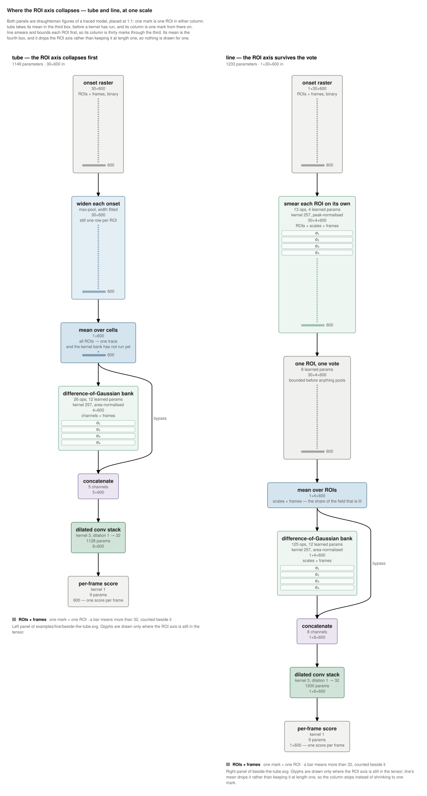

# `line` — the second bugarach model, and the first one drawn beside another

`figure.svg` is what draughtsman draws for `line`: a 1,233-parameter 1-D
coordinated-event detector from [`bugarach`](https://github.com/syncytium2/bugarach),
the same sibling project [`../tube/`](../tube/) comes from — public, and not a
dependency of this one.

**It was asked for as a comparison, not as a figure.** `line` exists because a
bugarach session asked whether `tube`'s weakness is architectural: `tube` averages
over ROIs **before** its first kernel, so four onsets from one cell and four cells
firing once are the same number. `line` counts instead — per-ROI smoothing at a
fitted width, a sigmoid so a bursting cell votes once, the mean over ROIs, and only
then the difference of Gaussians. The whole content of the architecture is
**where the ROI axis collapses**, which is a difference between two figures rather
than a fact inside either. So the deliverable here is
[`beside-the-tube.svg`](beside-the-tube.svg), and `figure.svg` is `line` in its own
right.

## The comparison, and what makes it one



Two panels, placed at 1:1 in one frame by
[`../../tools/beside.py`](../../tools/beside.py), so **one mark is one ROI in
either column**:

| panel | spec | what it draws |
|---|---|---|
| left | [`../tube/beside-line.json`](../tube/beside-line.json) | `tube`, glyphed only where the ROI axis is still in the tensor |
| right | [`beside-tube.json`](beside-tube.json) | `line`, by the same rules |

Read down the two columns of marks. `tube`'s runs for two boxes and is one mark by
the third, `mean over cells`, which is **before any kernel has run**. `line`'s runs
for three — the raster, the per-ROI smear, and the bounded vote — and the mean is
the fourth. That is the architecture, and neither caption is needed to see it.

**The panels are drawn by one set of rules, and that is not cosmetic.**
`examples/tube/spec.json` glyphs every stage and labels the middle axis
`channels` throughout, which is the mislabel CLAIMS.md queue item 2 is about: in
`tube` that axis is cells for three stages and channels after the bank. A
comparison built on it would have put a column labelled `channels` beside a column
labelled `ROIs` and invited the reader to compare them. So both panels glyph
**only the stages where the axis is genuinely ROIs**, and name it the same word in
both. `tests/test_beside.py` asserts that the two panels share one labelling and
one scale; `tools/beside.py` refuses to compose a pair that does not.

**One asymmetry in the drawing is a real difference between the tensors, not a
drawing choice.** `tube` takes its mean with the axis kept, so the tensor is still
`1×600` and the glyph can draw one mark where there were thirty. `line` takes
`mean(dim=1)` and the ROI axis is gone from the tensor entirely, so there is no
rectangle to draw for it and the column stops instead of shrinking. Drawing a
single mark there anyway would have been the figure asserting a shape the model
does not have — which is the one thing this repository will not do — so the
`mean over ROIs` stage carries no glyph and says so in its note.

## Provenance

| file | how |
|---|---|
| `graph.json` | `draughtsman trace bugarach.learn.nets.line:build_line --input-shape 1,30,600 -o graph.json`, against bugarach `75ccd03` on torch 2.14.0 |
| `spec.json` | stage 2 — written from the `draughtsman abstract graph.json` payload in a Claude Code session, 2026-09-15 |
| `figure.svg` | `draughtsman render spec.json -o figure.svg` |
| `icon.svg` | `draughtsman render spec.json --icon 192x96 -o icon.svg` |
| `beside-tube.json`, `../tube/beside-line.json` | the two panels, stage 2 again — top-to-bottom, no legend, `5in` each |
| `beside-the-tube.svg` | `python3 ../../tools/beside.py ../tube/beside-line.json beside-tube.json -o beside-the-tube.svg` |

⚠ **`line` is not on bugarach's `main`.** `75ccd03` is the tip of
`unsup/rigid-shift-controls`, where the architecture was written and measured on
2026-09-15. The model is a week old and still being measured — supervised on
bugarach's bake-off it scores F1 0.655 against `tube`'s 0.686, with the highest
precision of any learned model in that run — so the module it is traced from may
move before it lands. **That is exactly why `graph.json` is committed**, as
`../tube/graph.json` is: regenerating it needs bugarach installed, this repo does
not depend on bugarach, and the staleness test therefore runs on the committed
graph. It catches a spec or renderer change and it cannot catch a change to
bugarach's model. Regenerate by hand after one:

```
draughtsman trace bugarach.learn.nets.line:build_line --input-shape 1,30,600 \
    -o examples/line/graph.json
draughtsman check  examples/line/spec.json examples/line/graph.json
draughtsman render examples/line/spec.json -o examples/line/figure.svg
```

## What the figure says, and where each number comes from

Every quantity is resolved from `graph.json` by node id at render time. Nothing in
`spec.json` is a number:

| shown | from |
|---|---|
| `1233 parameters` | `{model.params}` |
| `13 ops, 4 learned params` | `{stage.nodes}`, `{stage.params}` |
| `kernel 257, peak-normalised` | `{node:n0051.out_shape[2]}` — the smear bank's kernel |
| four lanes on the smear | `{node:n0067.out_shape[1]}` — **one** convolution with four output channels, as `tube`'s bank is |
| four lanes on the DoG bank | `{node:n0492.out_shape[1]}` — the stacked output of **four separate convolutions**; see below |
| `kernel 257, area-normalised` | `{node:n0160.out_shape[2]}` |
| `8 channels` | `{stage.out_shape[1]}` |
| `dilation 1 → 32` | `{node:n0525.constants.dilation}`, `{node:n0565.constants.dilation}` |

The lane labels `σ₁ … σ₄` are the agent's and are indices rather than
measurements — every width in this model is a fitted parameter, so no width is a
fact `graph.json` holds. `check` asserts there are exactly as many labels as the
reference resolves to.

**No hazards.** `trace` records nothing under `hazards` for this model: unlike
`tube`, `line` computes no kernel width by taking `int()` of a trained parameter —
its `max_center_frames` is a build argument — so no `constants.*` reference here is
standing on an initialisation. The two dilations are declared architectural in the
spec anyway, for the same reason `tube` declares its two.

## The four `conv1d` calls, and what `lanes` does and does not prove

`line`'s per-scale stage is a **Python loop over four widths**, so the tracer
reports four `conv1d` calls — and the kernel construction four times over with them,
125 substantive operations in all — where the diagram wants one box carrying "four
scales". The queue asked whether that abstraction is the agent's to supply or
something `check` should learn to accept.

**It is the agent's, and no new mechanism was needed.** `lanes` already draws one
box with N labelled lanes and already takes its count from a `{reference}` rather
than from the agent, so the count is a fact either way — here it is
`{node:n0492.out_shape[1]}`, the channel axis of the `stack` the four convolutions
are gathered into. The stage collapses all 125 operations and the figure says four
because the graph says four.

**What that does not prove is that the four are parallel**, and this model is the
second instance of CLAIMS.md queue item 2 rather than an answer to it. In `tube`
the four lanes are four output channels of one convolution, which cannot be
sequential; in `line` they are four convolutions the trace records one after the
other, and nothing in `check` distinguishes "four independent branches gathered by
a `stack`" from "four blocks in sequence". They happen to be independent here —
each reads one channel of the count and none reads another's output — and that
happens to be visible in the graph's `tensor_inputs`. It is not checked, and a
heuristic that guessed would be worse than the gap: two sessions have already
agreed that item stays open until there is a design, and drawing this figure did
not produce one.

The `repeat` mechanism is the near miss worth naming, because it *does* prove a
count from the graph and it is the wrong shape here. `repeat` tiles a template
stage's operation sequence against a longer stage's and supplies the multiple, and
`line`'s loop does tile: the 124 operations inside it are exactly four copies of
the 31 one scale takes, with the `stack` that gathers them the 125th.
`draughtsman.facts.tiles` returns 4 for it. But
`repeat` draws **one unit plus "and N−1 more"**, two boxes, the way `whisper`'s
decoder is drawn. That is right for a deep stack where the copies run one after
another and wrong here, where the point is that four scales are looked at *at
once*. A verified count of sequential copies and a claim of parallelism are
different claims, and using the first to make the second is precisely what item 2
warns about.
